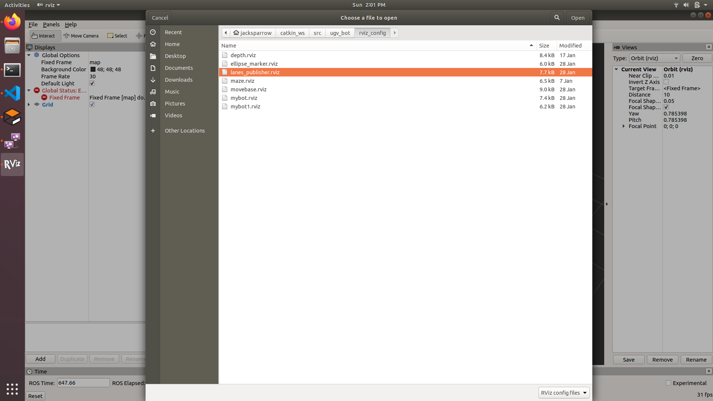
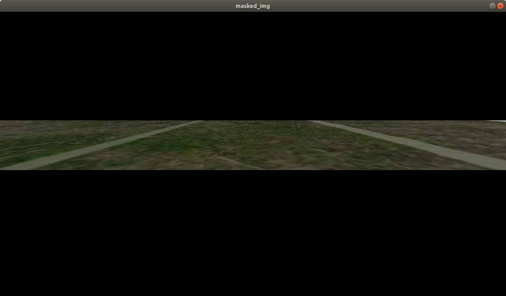
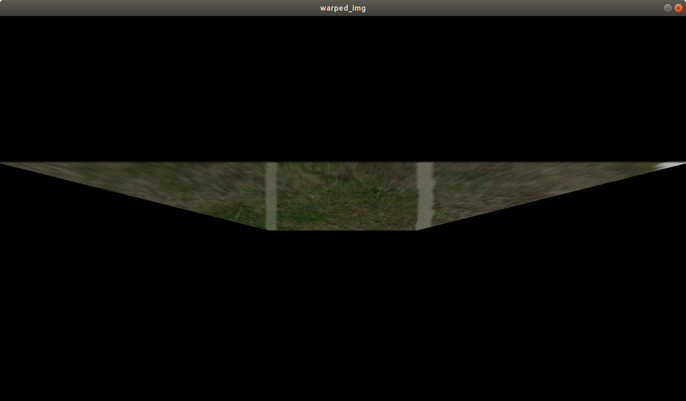
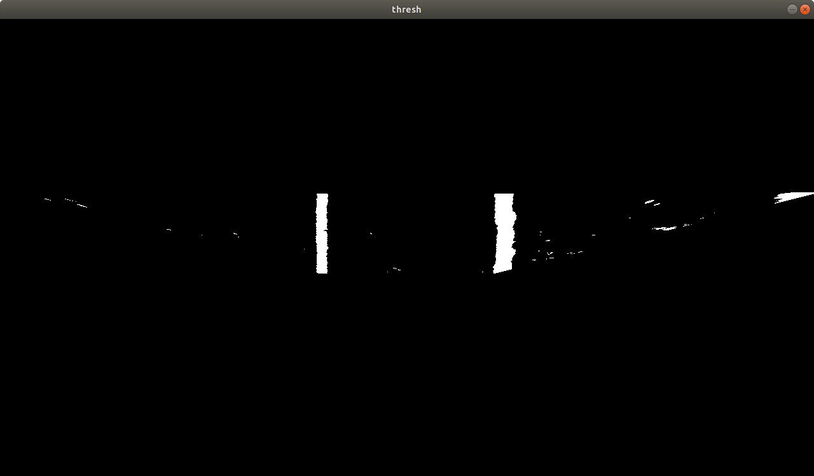
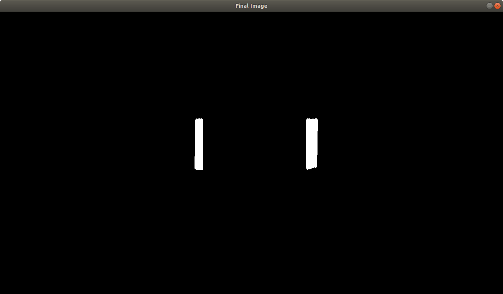
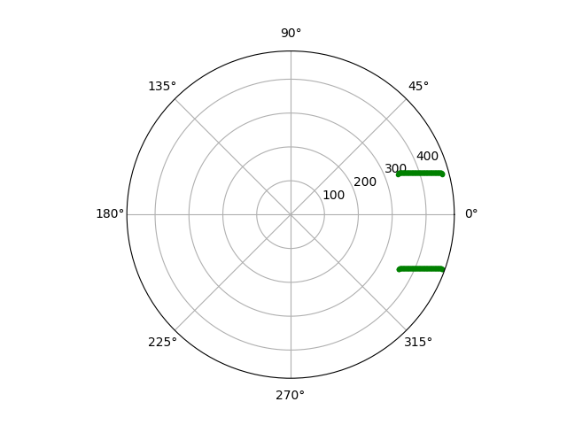

# Image Lanes to Laser Scan !!

>Uses a simple approach to extact lanes distance data,
>from image and convert it to a laser scan
>which will be published to rviz and can also be used for 
>mapping and localization packages such as costmap_2d or gmapping


## Running the scripts

Start by running the camera image subscriber service by command
```sh
rosrun ugv_bot camera_img_service
``` 
next open a new terminal tab by pressing ctrl+shift+tab

now run the image to laser scan script by command
```sh
rosrun ugv_bot lanes_pub_using_srv
```
after running these scripts, type rviz in new terminal, and open the lanes_publisher.rviz config file.
  


# Explanation
script starts from main

initiates a node named "Lanes_Processing_N_Publishing_service"

gets into image_client function the latest image from "get_camera_image_service" server and returns the responce_data.

Now this responce data is of standard compressedImage message type

the responce_data is passed to Image_Processor function

## Image_Processor()

>This function seperates the image data form message and does the following tasks.

1. Defines a mask and get the Region of interest using bitwise_and Operation.
  
  
2. Next transforms(warp) the image such that the straight lanes becomes straight lines as you can see below.  \
   In a sense this is the prespective transform of the image.
  
  
3. Now this image undergoes a binary thresholding for seperating the white pixels
  
  
4. To finally get only lanes in the image the hough transform is used.
  

> Before moving to the lanes to laser aspect, the final processed image is published to "/ugvbot/image_processed" topic via Img_msg_Publisher function.

## laser_processor()

>This function converts the lanes from the final image, to do so i used the following procedure:

1. First the coordinates of all the white pixels are stored in a list called "cord" using the function whitePixelSearch.

2. As these cordinates are in the image coordinate system i.e (0,0) on top left, we have to convert these wrt our bot which is at bottom mid in the image.
   Which can done by shifting the origin, but thats something a noobs will do. 
   I took a step forward and converted it to polar cordinates wrt bot, that is done in the cartToPolar function,
   if ploted it looks like
  

3. Now the only task left is to convert these polar distances to real world polar disrances.

> which is done in the converterForRviz function

## converterForRviz()


